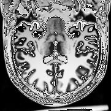
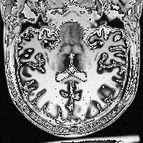
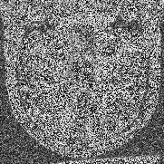

# 2D-noisy-image-dataset

The goal of this repository is to programatically create a dataset of noisy 2D images from a 3D MRI.

## Source RMI image

Two RMI images were downloaded from [brainweb project](https://brainweb.bic.mni.mcgill.ca/selection_normal.html).
Here the detail of each RMI image:
- Clean RMI:
  - *Parameters*: Modality=T1, Protocol=ICBM, Phantom_name=normal, Slice_thickness=1mm, Noise=0%, INU=20%
  - *Path*: img/mnc/t1_icbm_normal_1mm_pn0_rf20.mnc.gz
- Noisy 1% RMI:
  - *Parameters*: Modality=T1, Protocol=ICBM, Phantom_name=normal, Slice_thickness=1mm, Noise=1%, INU=20%
  - *Path*: img/mnc/t1_icbm_normal_1mm_pn1_rf20.mnc.gz
- Noisy 3% RMI:
  - *Parameters*: Modality=T1, Protocol=ICBM, Phantom_name=normal, Slice_thickness=1mm, Noise=3%, INU=20%
  - *Path*: img/mnc/t1_icbm_normal_1mm_pn3_rf20.mnc.gz
- Noisy 5% RMI:
  - *Parameters*: Modality=T1, Protocol=ICBM, Phantom_name=normal, Slice_thickness=1mm, Noise=5%, INU=20%
  - *Path*: img/mnc/t1_icbm_normal_1mm_pn5_rf20.mnc.gz
- Noisy 7% RMI:
  - *Parameters*: Modality=T1, Protocol=ICBM, Phantom_name=normal, Slice_thickness=1mm, Noise=7%, INU=20%
  - *Path*: img/mnc/t1_icbm_normal_1mm_pn7_rf20.mnc.gz
- Noisy 9% RMI:
  - *Parameters*: Modality=T1, Protocol=ICBM, Phantom_name=normal, Slice_thickness=1mm, Noise=9%, INU=20%
  - *Path*: img/mnc/t1_icbm_normal_1mm_pn9_rf20.mnc.gz

## Convert mnc to nii image

In order to use the ITK we need the nii RMI format.

*Note 1*: Before running this command you must install the mnc2nii toolkit: https://bic-mni.github.io/#using.

*Note 2*: this script compress the nii image using gzip.

In order to convert the mnc image to nii run this command: 
```bash
$ ./convert_images.bsh
```

## Slice 3D image

Using ITK slice the 3D image in a set of 2D images

- Generate the clean images:
```bash
$ ./build/Slice3DImage ./img/nifti/in/t1_icbm_normal_1mm_pn0_rf20.nii.gz ./img/dataset/clean/clean_ 1
```

- Generate the noisy images:
```bash
$ ./build/Slice3DImage ./img/nifti/in/t1_icbm_normal_1mm_pn9_rf20.nii.gz ./img/dataset/noisy_1/noisy_1_ 1
```

If you need to generate complete datasets:
```bash
$ ./generate_datasets.bsh
```

## Datasets

Here a description of available datasets:

| Clean                   | Noisy 1%                  | Noisy 3%                  | Noisy 5%                  | Noisy 7%                  | Noisy 9%
| ----------------------- | ------------------------- | ------------------------- | ------------------------- | ------------------------- | ------------------------- |
| Path: img/dataset/clean | Path: img/dataset/noisy_1 | Path: img/dataset/noisy_3 | Path: img/dataset/noisy_5 | Path: img/dataset/noisy_7 | Path: img/dataset/noisy_9 |

*NOTE*: all images are in png format.

Sample:
| Clean Sample                                | Noisy 1% Sample                                    | Noisy 5% Sample                                    |  Noisy 9% Sample                                    |
| ------------------------------------------- | -------------------------------------------------- | -------------------------------------------------- |  -------------------------------------------------- |
|  |  |  |  |